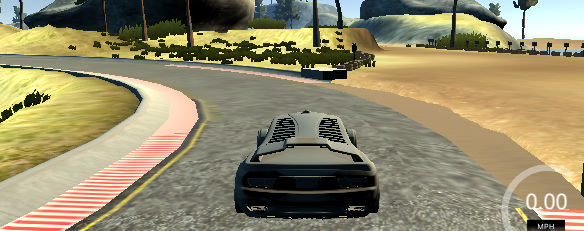
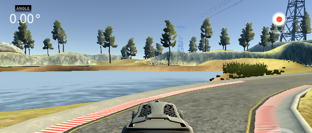

# Driving-Behavior-Cloning
Neural Network that mimics the driving behavior


### The goals/steps of this project are the following:
* Use the driving simulator to collect data of good driving behavior
* Build, a convolution neural network in Keras that predicts steering angles from images
* Train and validate the model with a training and validation set
* Test that the model successfully drives around multiple tracks without leaving the road

### This project includes the following files:
* behavior_cloning.py containing the script to train the model and use model for inference (if required)
* utils.py containing supplementary python functions
* download_resources.sh shell file to download driving-simulator and default-training-dataset
* drive.py for driving the car in autonomous mode
* model.h5 containing a trained convolution neural network

### Driving the car autonomously 
driving-simulator-files, `drive.py` script and the saved model file is required to run the car autonomously in the simulator 
driving-simulator-files would be downloaded if `download_resources.sh` script is run.
```sh
./linux_sim/linux_sim.x86_64
```
run this command to start the simulator, then select default options (as training data was recorded using the default settings)

```sh
python3 drive.py -s=17 -vfd=./output
```
this command start a server that continuously posts steering angle information to the simulator, also './output' is the directory where the video frame is stored.

start simulation, drive.py is waiting for the simulation to start, select a track and click autonomous mode. Now, one should see the car moving forward.


```sh
python3 video.py ./output
```
this commands converts stored video frames to a video file.

### Model Architecture
The following table summaries the stacked layers used to build behavior-cloning-network
file utils.py method get_model(...)

| Layer              | Input  | Output | Params |
|:------             |:-------|:-------|:-------|
| Cropping2D         | (?, 160, 320, 3) | (?, 90, 320, 3) | 0 |
| Lambda             | (?, 90, 320, 3)  | (?, 66, 200, 3) | 0 |
| Lambda             | (?, 66, 200, 3)  | (?, 66, 200, 3) | 0 |
| Conv2D             | (?, 66, 200, 3)  | (?, 31, 98, 24) | 1824 |
| BatchNormalization | (?, 31, 98, 24)  | (?, 31, 98, 24) | 96 |
| Activation         | (?, 31, 98, 24)  | (?, 31, 98, 24) | 0 |
| Dropout            | (?, 31, 98, 24)  | (?, 31, 98, 24) | 0 |
| Conv2D             | (?, 31, 98, 24)  | (?, 14, 47, 36) | 21636 |
| BatchNormalization | (?, 14, 47, 36)  | (?, 14, 47, 36) | 144 |
| Activation         | (?, 14, 47, 36)  | (?, 14, 47, 36) | 0 |
| Dropout            | (?, 14, 47, 36)  | (?, 14, 47, 36) | 0 |
| Conv2D             | (?, 14, 47, 36)  | (?, 5, 22, 48)  | 43248 |
| BatchNormalization | (?, 5, 22, 48)   | (?, 5, 22, 48)  | 192 |
| Activation         | (?, 5, 22, 48)   | (?, 5, 22, 48)  | 0 |
| Dropout            | (?, 5, 22, 48)   | (?, 5, 22, 48)  | 0 |
| Conv2D             | (?, 5, 22, 48)   | (?, 3, 20, 64)  | 27712 |
| BatchNormalization | (?, 3, 20, 64)   | (?, 3, 20, 64)  | 256 |
| Activation         | (?, 3, 20, 64)   | (?, 3, 20, 64)  | 0 |
| Dropout            | (?, 3, 20, 64)   | (?, 3, 20, 64)  | 0 |
| Conv2D             | (?, 3, 20, 64)   | (?, 1, 18, 64)  | 36928 |
| BatchNormalization | (?, 1, 18, 64)   | (?, 1, 18, 64)  | 256 |
| Activation         | (?, 1, 18, 64)   | (?, 1, 18, 64)  | 0 |
| Dropout            | (?, 1, 18, 64)   | (?, 1, 18, 64)  | 0 |
| Flatten            | (?, 1, 18, 64)   | (?, 1152)       | 0 |
| Dense              | (?, 1152)        | (?, 100)        | 115300 |
| BatchNormalization | (?, 100)         | (?, 100)        | 400 |
| Activation         | (?, 100)         | (?, 100)        | 0 |
| Dropout            | (?, 100)         | (?, 100)        | 0 |
| Dense              | (?, 100)         | (?, 50)         | 5050 |
| Dense              | (?, 50)          | (?, 10)         | 510 |
| Dense              | (?, 10)          | (?, 1)          | 11 |

*Total params: 253,563*

*Trainable params: 252,891*

*Non-trainable params: 672*


### Creation of the Training Set & Training Process
1. Three sets of datasets were created:
 * Track-1
   * One lap of recorded driving data in both clockwise and counter-clockwise direction. 12882 images were recorded (includes images from the center, left and right camera).
 * Track-2
   * One lap of recorded data in both clockwise and counter-clockwise direction while ensuring the car is almost in the center of the lane this was achieved by driving under 12mph. 24009 images were recorded (includes images from the center, left and right camera).
   * Two laps of recorded data in both clockwise and counter-clockwise direction while driving as fast as possible and ensuring the car never goes off track. This approach included a number of situations where the car had to recover from almost going off track. 44550 images were recorded (includes images from the center, left and right camera).
   * 81432 images were recorded in total
2. The above three datasets were stored in three distinct directories so that experiments could be done using specific datasets
3. Analog joystick was used to record a more accurate reading of steering angles
4. Later the union of the three aforementioned datasets was split into the training dataset and validation dataset where the train-test split ratio was 75-25.

#### Training methodology
* The network was trained for a maximum of 30 epochs with an initial learning rate if 3e-3. Four callbacks were added to the model:
 1. Reduce learning rate if validation loss plateaus. A plateau here is defined as a max decrease of validation loss by 0.005 for 3 epochs.
 2. Terminate the learning process if NaN was encountered
 3. Early stop learning process if validation loss does not decrease even by 0.005 after 9 epochs.
 4. Record tensorboard logs for network visualization.
* A custom generator was used to create training and validation batches on the fly.

#### Avoiding overfitting
To avoid overfitting training data was augmented by flipping every image in the dataset, batch-normalize convolution layer followed by dropout. Also, the first fully-connected layer was regularized using dropout layer and the subsequent fully connected layer was regularized using l2-regularizer.   

#### Parameter tuning
To train the network a batch-size of 32 samples was used with convolution dropout rate of 0.15, fully connected layer dropout rate of 0.65, l2-regularization-constant 5e-4 and initial learning rate of 3e-3 with Adam optimizer.

### Experiments
* The first experiment was using LeNet model and default-training-dataset, the model frequently used to get off-track and the car never drove past the bridge over the lake.
* To improve the performance, a higher capacity network was used (this network had 4M trainable parameters which is significantly higher than the final selected model), this model drove well for most of the track except for the below two tricky turns.

<div>
  
  
</div>

* Instead of altering model architecture, a custom dataset was collected as mentioned in point 1.1 (of Creation of the Training Set & Training Process). The model drove around the track ideally with smooth turns around the above mentioned two difficult tracks, even at the top speed of 30 mph. However, for track-2 the model could not get past the first turn.
* Next, additional track-2 related data were added as mentioned in point 1.2 (of Creation of the Training Set & Training Process) the model trained drove properly around track-1, however, the model used to drive off-track frequently for track-02. This was perplexing since the mean squared error loss for both training and validation dataset were lower than the previous iteration.
* To mitigate this issue a comparatively lower capacity model (one mentioned in this report above) was selected. The performance of this model was good for both tracks even though the validation loss and training loss were higher.
 * Even at top-speed 30mph the model drove the car the around track-01 adequately. Although the deeper model that was previously selected drove the car perfectly at top speed. But this can be explained since the previous model was trained exclusively with track-01 data and the current model was trained with a dataset with only 15% track-01 image frames. Hence the driving behavior learned has significant influence from track-02 frames.  
 * At top speed 30, the model required manual interventions at certain turns to complete the track although it was able to drive extremely challenging stretches of track successfully at top speed. Even collecting data (while maintaining top speed) was arduous and at several sharp turns, brakes were applied to prevent the car from going off track.
 * Since the model drives around track-02 completely autonomously till speed 25, a better quality training dataset would further improve the performance of the model for track-02.
* Finally, the same model was used to drive around mountain track (present in an older iteration of the simulator). 

### Plots


### Simulation Results

#### Track 01 - Speed 17

<a href="http://www.youtube.com/watch?feature=player_embedded&v=jCTxx-YGvyA" target="_blank">
  
</a>

#### Track 02 - Speed 17

<a href="http://www.youtube.com/watch?feature=player_embedded&v=tyBBI21rO08" target="_blank">
  
</a>

#### Mountain track - Speed 17
frames from this track were not used during training process

<a href="http://www.youtube.com/watch?feature=player_embedded&v=OZRx8RWHKHg" target="_blank">
  
</a>

### Future work

* Instead if mimicking the driving behavior of the dataset curator, once can manually create a very small dataset with perfect steer angles at positions in the track. For this approach since the dataset size would be small. Hence the network would have to be regularized robustly to prevent overfitting.
* End to end training for behavior cloning is presumably a weak approach, since the behavior learned do not seem to be easily transferable as seen from mountain track. Reinforcement learning might be a better suited to tackle this problem.
